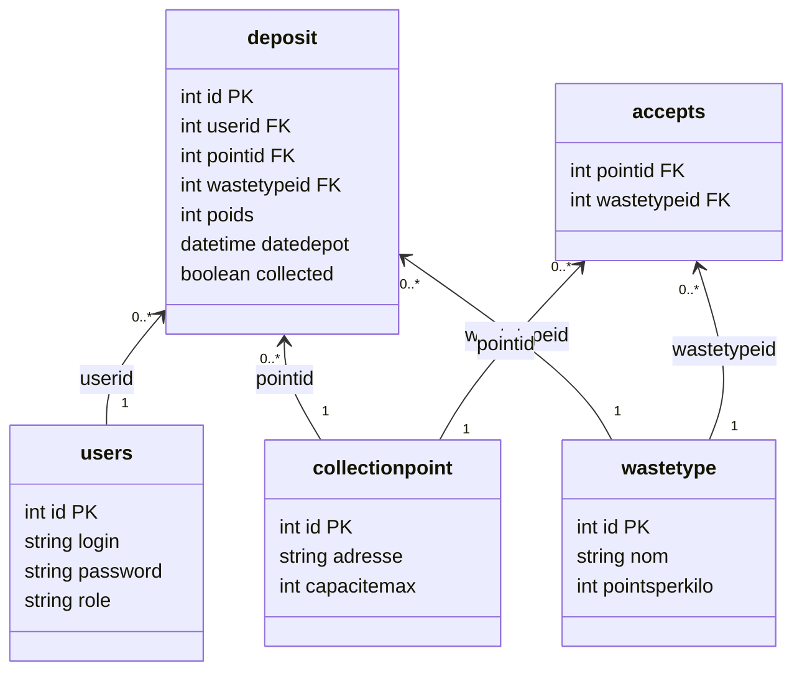

# Documentation de l'API Ecodrop

Ce document fournit la documentation de l'API REST pour le projet Ecodrop.

## Liste des administrateurs :

Afin de tester les fonctionnalitées réservées aux administrateurs, il est nécessaire d'utiliser la connection avec Gitlab en utilisant un de ces identifiants :

 - philippe.mathieu@univ-lille.fr
 - jonas.facon.etu@univ-lille.fr
 - edi.hamiti.etu@univ-lille.fr

## Authentification

# JONAS STP REMPLIS CETTE PARTIE

## Endpoints disponibles

[Types de déchets](docs/waste-types.md)

[Points de Collecte](docs/collection-points.md)

## Base de données

# TODO: Ajouter le schéma de la base de données, et les requêtes SQL complexes

