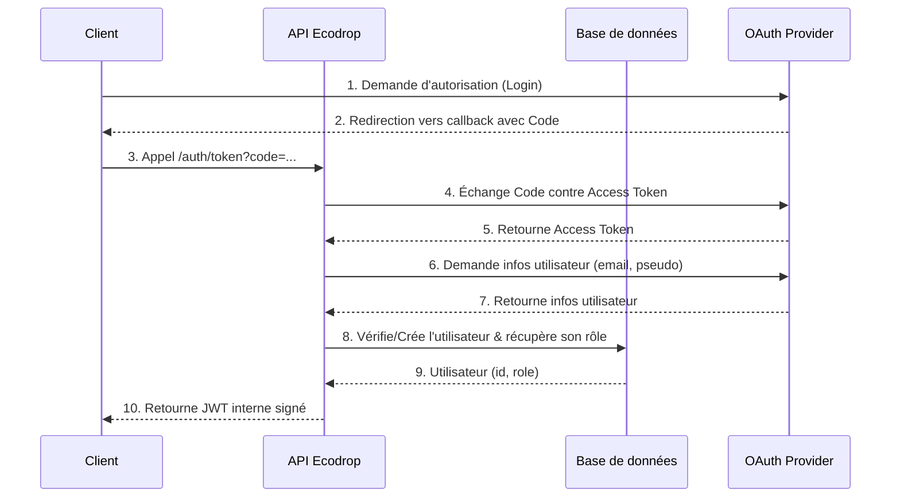
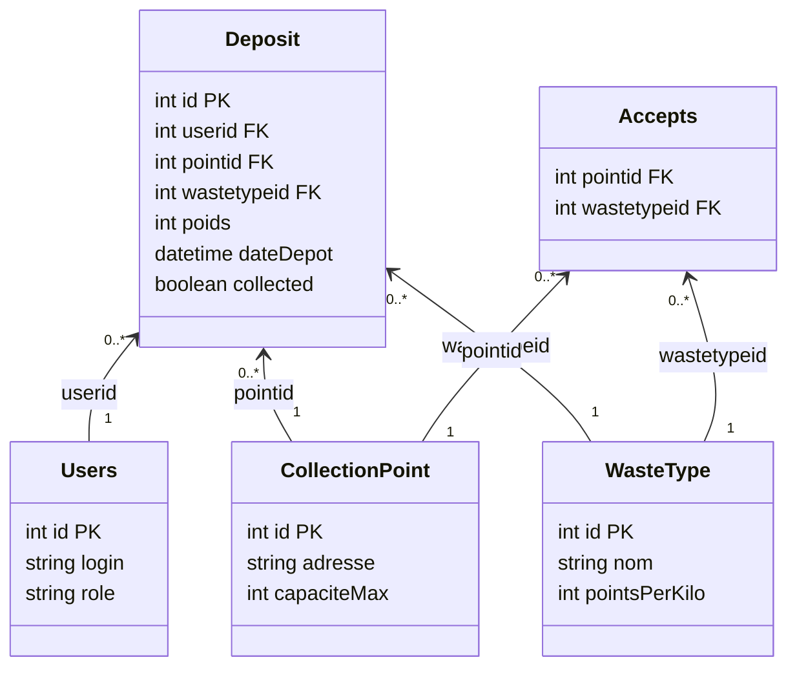

# Documentation de l'API Ecodrop

Ce document fournit la documentation de l'API REST pour le projet Ecodrop.

## Liste des administrateurs :

Afin de tester les fonctionnalitées réservées aux administrateurs, il est nécessaire d'utiliser la connection avec Gitlab en utilisant un de ces identifiants :

 - philippe.mathieu@univ-lille.fr
 - jonas.facon.etu@univ-lille.fr
 - edi.hamiti.etu@univ-lille.fr

## Authentification

Le projet utilise un système d'authentification déléguée basé sur le protocole **OAuth2**. Nous ne stockons pas de mots de passe ; l'identité des utilisateurs est vérifiée par des fournisseurs de confiance (GitLab, Discord, Google, GitHub).

### Fonctionnement du flux

1.  **Sélection du fournisseur** : L'utilisateur choisit un service (ex: GitLab) sur la page d'accueil.
2.  **Autorisation externe** : L'utilisateur est redirigé vers le site du fournisseur pour autoriser Ecodrop à accéder à ses informations de profil (email, pseudo).
3.  **Échange du code** : Le fournisseur redirige l'utilisateur vers notre API (`/auth/token`) avec un *Authorization Code*.
4.  **Récupération de l'identité** : L'API échange ce code contre un *Access Token*, puis récupère les informations de l'utilisateur.
5.  **Persistance et Rôle** : L'API vérifie si l'utilisateur existe en base de données. S'il s'agit d'une première connexion, un compte est créé. Le rôle (USER ou ADMIN) est récupéré.
6.  **Génération du JWT** : L'API génère un jeton **JWT (JSON Web Token)** signé, contenant l'ID, l'email et le rôle de l'utilisateur. Ce jeton doit être envoyé par le client dans le header `Authorization: Bearer <token>` pour chaque requête protégée.

### Autorisations et Rôles

Le `SecurityFilter` de l'API applique les règles suivantes :

| Méthode | Endpoint | Accès |
| :--- | :--- | :--- |
| `GET` | *(tous sauf exception)* | **Public** |
| `GET` | `/points/overloaded` | **ADMIN** |
| `POST` | `/deposits` | **USER** / **ADMIN** |
| `DELETE` | *(tous)* | **ADMIN** |
| `POST`, `PUT`, `PATCH` | *(autres)* | **ADMIN** |

## Limitation de débit (Rate Limiting)

Pour garantir la stabilité du service, une limitation de débit est appliquée sur l'ensemble des endpoints de l'API :

- **Limite** : 100 requêtes par minute et par adresse IP.
- **Dépassement** : En cas de dépassement de cette limite, l'API renvoie un code d'erreur `429 Too Many Requests`.

## Pagination

Les endpoints listant plusieurs ressources (points de collecte, dépôts, utilisateurs, etc.) supportent la pagination via deux paramètres de requête optionnels :

- **`limit`** : Nombre maximum de résultats à retourner.
  - **Valeur par défaut** : 20
- **`offset`** : Nombre de résultats à sauter avant de commencer à retourner les données.
  - **Valeur par défaut** : 0

Exemple d'utilisation : `/ecodrop/users/leaderboard?limit=5&offset=10`

## Formats de données

L'API supporte les formats **JSON** (par défaut) et **XML** pour les échanges de données.

- **Pour l'envoi de données** (`POST`, `PUT`, `PATCH`) : Spécifiez le format dans le header `Content-Type` (ex: `application/json` ou `application/xml`).
- **Pour la réception de données** (`GET`) : Spécifiez le format souhaité dans le header `Accept` (ex: `application/json` ou `application/xml`).

## Endpoints disponibles

*   [Authentification (Token)](docs/token.md)
*   [Utilisateurs](docs/users.md)
*   [Types de déchets](docs/waste-types.md)
*   [Points de Collecte](docs/collection-points.md)
*   [Dépôts](docs/deposits.md)

## Base de données

Le schéma suivant représente l'organisation des données dans l'application.

